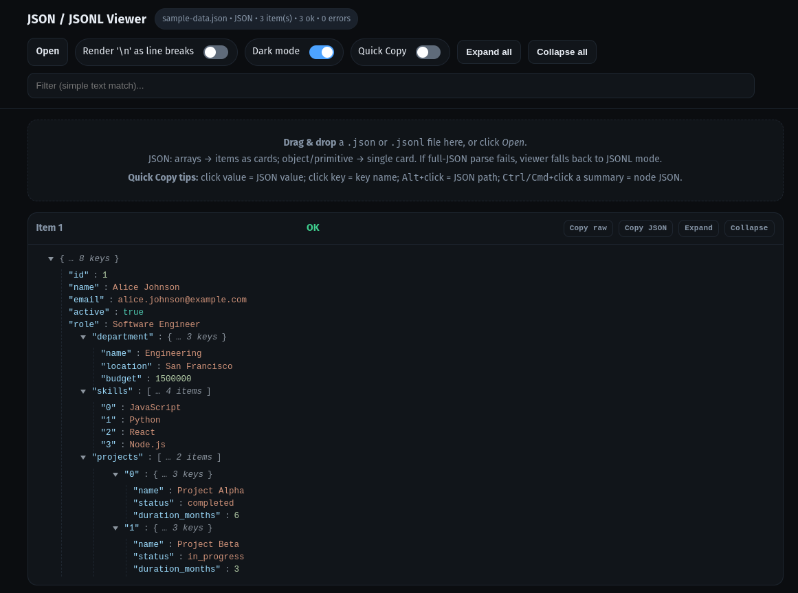

# JSON / JSONL Viewer

A lightweight, web-based JSON and JSONL (JSON Lines) file viewer with an intuitive interface and powerful features for exploring structured data.

## Screenshot



*The JSON/JSONL Viewer showing an interactive tree view with syntax highlighting and quick copy functionality.*

## Features

### 🔍 **Smart File Detection**
- **JSON Mode**: Automatically detects and renders JSON arrays as individual cards
- **JSONL Mode**: Parses JSON Lines format with each line as a separate item
- **Auto-fallback**: If JSON parsing fails, automatically switches to JSONL mode

### 📁 **File Input Options**
- **Drag & Drop**: Simply drag and drop files onto the interface
- **File Browser**: Click "Open" to browse and select files
- **Supported formats**: `.json`, `.jsonl`, `.txt`, `.log`

### 🌳 **Interactive Tree View**
- **Expandable/Collapsible nodes**: Navigate through nested JSON structures
- **Syntax highlighting**: Color-coded values (strings, numbers, booleans, null)
- **Monospace font**: Clean, readable code display

### 🎨 **Theme Support**
- **Dark/Light modes**: Toggle between themes or follow system preference
- **Modern design**: Clean, responsive interface with smooth transitions

### 📋 **Quick Copy System**
- **Click value**: Copy JSON value to clipboard
- **Click key**: Copy key name to clipboard
- **Alt + Click**: Copy JSON path (e.g., `$.users[0].name`)
- **Ctrl/Cmd + Click summary**: Copy entire node as JSON

### 🔧 **Advanced Controls**
- **Expand/Collapse All**: Bulk operations for all tree nodes
- **Search/Filter**: Real-time filtering of items by text content
- **Newline Rendering**: Toggle between escaped (`\n`) and actual line breaks
- **Individual Item Controls**: Copy raw text, copy as JSON, expand/collapse per item

### 📊 **Status Information**
- **File statistics**: Shows filename, mode, item count, parse success/error counts
- **Filter feedback**: Displays number of matching items when searching
- **Toast notifications**: User-friendly feedback for copy operations

## Usage

### Online
Open the `index.html` file in any modern web browser - no server required!

### Local Development
```bash
# Clone the repository
git clone https://github.com/ibndias/jsonlviewer.git
cd jsonlviewer

# Open in browser
open index.html
# or
python -m http.server 8000  # then visit http://localhost:8000
```

## Examples

### JSON File Example
```json
[
  {"id": 1, "name": "Alice", "active": true},
  {"id": 2, "name": "Bob", "active": false}
]
```

### JSONL File Example
```jsonl
{"timestamp": "2024-01-01T00:00:00Z", "level": "info", "message": "Server started"}
{"timestamp": "2024-01-01T00:01:00Z", "level": "error", "message": "Connection failed"}
```

### Try It Out
The repository includes sample data files you can use to test the viewer:
- `sample-data.json` - Employee data with nested objects and arrays
- `sample-logs.jsonl` - Sample log entries in JSONL format

Simply drag and drop these files onto the viewer interface to see it in action!

## Quick Copy Examples

With the Quick Copy System:
- Click on `"Alice"` → copies `"Alice"`
- Click on `name` → copies `name`
- Alt + click on `"Alice"` → copies `$[0].name`
- Ctrl/Cmd + click on object summary → copies `{"id": 1, "name": "Alice", "active": true}`

## Browser Compatibility

- ✅ Chrome/Edge 88+
- ✅ Firefox 78+
- ✅ Safari 14+
- ✅ Mobile browsers (responsive design)

## Technical Details

- **Pure HTML/CSS/JavaScript**: No dependencies or build process required
- **Client-side only**: All processing happens in your browser
- **Memory efficient**: Handles large files with lazy rendering
- **Keyboard accessible**: Full keyboard navigation support

## Contributing

1. Fork the repository
2. Create a feature branch: `git checkout -b feature-name`
3. Make your changes
4. Test in multiple browsers
5. Submit a pull request

## License

MIT License - feel free to use this project for any purpose.

## Credits

Created by **ibndias**

---

**Perfect for:**
- 📊 Data analysis and exploration
- 🔍 Log file investigation
- 🧪 API response debugging
- 📝 JSON structure documentation
- 🛠️ Development and testing workflows
